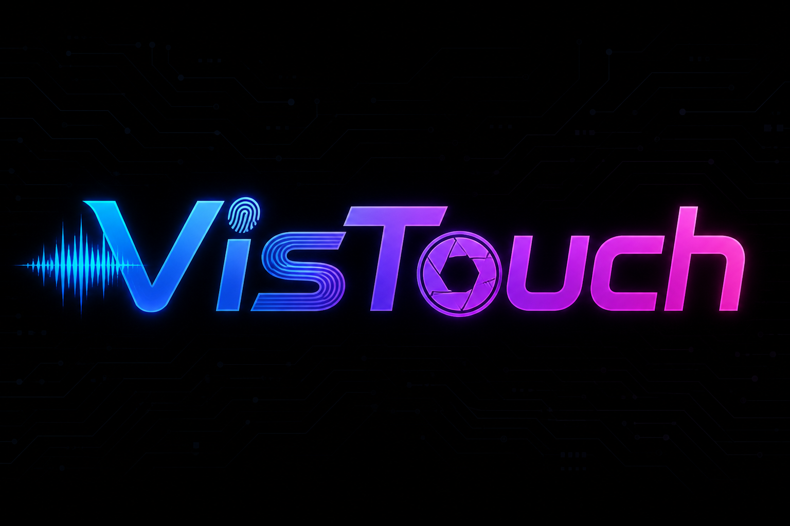
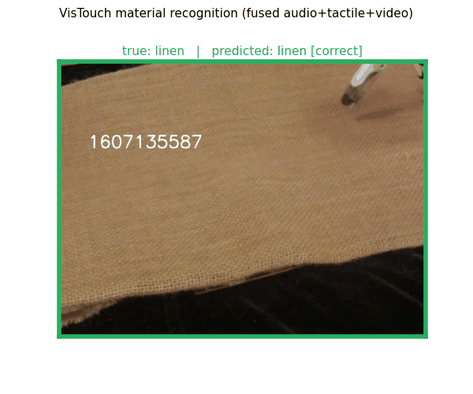
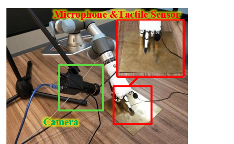

<p align="center">
  
</p>

<h3 align="center">A large-scale synchronized vision–touch–audio dataset of robotic sliding contact</h3>

<p align="center">
  
  
  
  
</p>

---

## 🎬 What you can do with VisTouch

<table>
  <tr>
    <td width="50%" align="center">
      <br/>
      <b>🏷️ Material Recognition</b><br/>
      <sub>fused audio+tactile+video · <b>65.4%</b> test acc (chance 12.5%)</sub>
    </td>
    <td width="50%" align="center">
      <br/>
      <b>🧵 Tactile Super-Resolution</b><br/>
      <sub>clean 100Hz force curve from noisy low-rate input · <b>−84.9% MSE</b>, 0.993 corr</sub>
    </td>
  </tr>
  <tr>
    <td width="50%" align="center">
      <br/>
      <b>🧩 Multimodal Tactile Completion</b><br/>
      <sub>audio + video + tactile context → missing force block · <b>−90.0% MSE</b>, 0.968 corr</sub>
    </td>
    <td width="50%" align="center">
      <br/>
      <b>🔄 Cross-Modal Generation</b><br/>
      <sub>haptic recovery: tactile force envelope generated from sound alone · <b>0.790</b> corr</sub>
    </td>
  </tr>
</table>

## 📖 About

**VisTouch** originates from the experiments reported in
[*Cross-Modal Semantic Communications*](https://doi.org/10.1109/MWC.008.2200180).
A robot arm and dexterous hand press and slide across everyday surfaces
while a fixed camera, microphone, and tactile force sensor observe the same
contact event.

The dataset provides paired video, contact audio, and force-tactile
trajectories for material understanding and cross-modal learning. To the
best of our knowledge, **VisTouch is the world's first public dataset with
strict event-level synchronization of vision, sound, and force-tactile
signals.**

The public release contains **10,498 synchronized clips** covering **8
materials**: brass, linen, paper, polyester, silk, spandex, stone, and wood.

Synchronization uses a shared wall clock, clips every modality to their
common valid time range, maps video frames onto that timeline, and applies
identical temporal boundaries and interpolation to every modality.

Capture hardware: a 2K-class camera (released video: 640×480 at 30 fps),
an Audio-Technica AT9912 microphone sampled at 16 kHz, and the integrated
pressure/force sensing channel of the RH56BF3 dexterous hand.

<p align="center">
  <br/>
  <sub>Capture rig: dexterous hand + microphone + tactile sensor, fixed camera view.</sub>
</p>

## 📥 Download

The data files are hosted externally — this repository ships with an empty
`dataset/` folder:

| Source | Link |
|---|---|
| ☁️ Baidu Netdisk | [pan.baidu.com/s/111Nqcwbk30hZRAOpxANKQg](https://pan.baidu.com/s/111Nqcwbk30hZRAOpxANKQg) · extraction code `1234` |

After downloading, place the contents inside the `dataset/` folder at the
repository root:

```
VisTouch/
└── dataset/
    ├── audio/         # contact audio
    ├── tactile/       # force-tactile trajectories
    └── video/         # contact video
```

All file paths in `metadata/clips_index.csv` (and every benchmark script) resolve
relative to this layout, so no further configuration is needed.

## 🚀 Quick start

```
VisTouch/
├── dataset/            # audio/ tactile/ video/  (empty in this repo — see Download above)
├── metadata/           # samples.csv · sessions.csv · clips_index.csv · frames_index.csv · classes.json
├── scripts/            # dataloader.py · classify_baseline.py · tasks/
└── docs/               # reports, alignment/quality docs, demo assets, logs/
```

```python
from dataloader import VisTouchClipDataset, get_dataloader

clips = VisTouchClipDataset(classes=["silk", "stone"],   # choose any available materials
                            modalities=("audio", "tactile"),
                            split="train")
loader = get_dataloader(clips, batch_size=8, shuffle=True)
```

```bash
cd scripts
python dataloader.py --classes silk stone --modalities audio tactile --split train
python classify_baseline.py                             # reproduce the classification baseline
python tasks/tactile_super_resolution.py                # reproduce any task baseline
```

Micro-clips use concise paired names such as `brass_video_000001.avi`,
`brass_audio_000001.wav`, and `brass_tactile_000001.csv`. Clip labels,
provenance, source epochs, and file paths live in
`metadata/clips_index.csv`; source-segment and frame provenance remain in
`metadata/samples.csv` and `metadata/frames_index.csv`.

## 🏆 Benchmarks

All baselines were retrained on the materialized contact clips with the
predefined cross-condition split:

| Task | Model | Metric | Result | Details | Log |
|---|---|---|---|---|---|
| Material recognition | RandomForest, fused 3 modalities | accuracy | **65.4%** (chance 12.5%) | [report](docs/classification_report.md) | [log](docs/logs/classify_clips.log) |
| Tactile super-resolution | 1D CNN | MSE vs. naive input | **−84.9%** · corr 0.993 | [report](docs/tactile_sr_report.md) | [log](docs/logs/tactile_super_resolution.log) |
| Multimodal tactile completion | residual temporal CNN, audio+video+touch context | MSE vs. linear interpolation | **−90.0%** · corr 0.968 | [report](docs/multimodal_tactile_completion_report.md) | [log](docs/logs/multimodal_tactile_completion.log) |
| Cross-modal generation (haptic recovery) | dilated residual CNN, sound → tactile force envelope | MAE / correlation | **0.338 / 0.790** | [report](docs/cross_modal_generation_report.md) | [log](docs/logs/cross_modal_generation.log) |

All baselines are intentionally lightweight (CPU-trainable in minutes) and
serve as usability floors, not state-of-the-art. Trained weights ship in
`scripts/tasks/weights/`; full training/test console records live in
[`docs/logs/`](docs/logs/).

Every source signal passed an automated anomaly screen for physically
impossible tactile glitches and isolated audio pops. Full findings:
[`docs/logs/anomaly_check.log`](docs/logs/anomaly_check.log).

## 🗺️ Roadmap

- [ ] Release additional material categories
- [ ] Additional slide paths and camera views
- [ ] Deep baselines (spectrogram CNNs, video transformers, full waveform generation)

## 📄 Citation

If you use VisTouch, please cite:

```bibtex
@article{li2022crossmodal,
  title   = {Cross-Modal Semantic Communications},
  author  = {Li, Ang and Wei, Xin and Wu, Dan and Zhou, Liang},
  journal = {IEEE Wireless Communications},
  volume  = {29},
  number  = {6},
  pages   = {144--151},
  year    = {2022},
  doi     = {10.1109/MWC.008.2200180}
}
```

## ⚖️ License

Dataset files are released under **CC-BY-4.0** (`DATA_LICENSE`); all code
under **MIT** (`LICENSE`).
