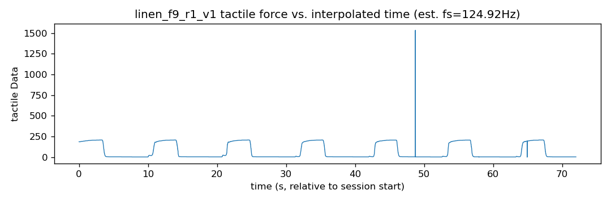
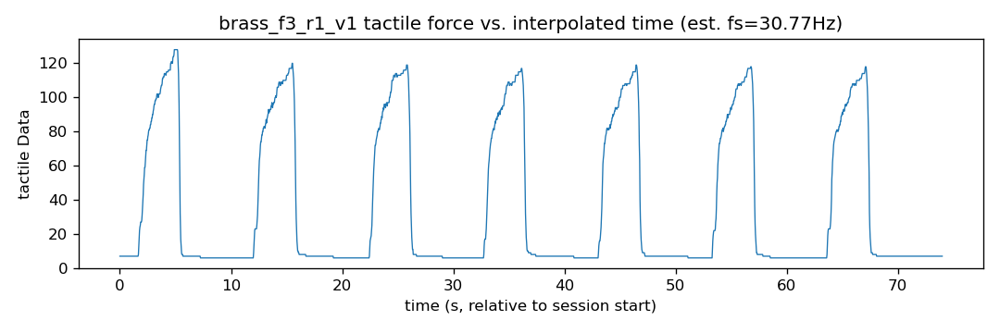

# VisTouch Timestamp Alignment Report

Canonical per-session time window = `[audio_start_unix, audio_end_unix]` from the raw `audiotime.csv`. Audio and tactile share the same synced wall clock (their epoch values match almost exactly at session start, verified below), but each modality was started/stopped independently by one of the three operators/PCs used during collection (one PC each for audio, tactile, and video), so the *duration actually covered* by each modality's own recording can differ by a few seconds even though the clocks agree. In particular tactile logging is typically stopped a few seconds before the audio/video recording (operator lifted the probe / stopped tactile capture first) -- this is expected raw-data asynchrony, not an alignment bug, and step 3 clips segment boundaries to the intersection of all three modalities' actual coverage windows to handle it. Video has no independent timestamp file (only an on-screen burned-in overlay that would require OCR/tesseract, unavailable in this environment) and is therefore aligned with a linear frame-index -> epoch approximation over the audio window, assuming the pre-capture PC clock sync held.

| session_id | audio_dur_s | tactile_span_s | video_dur_s | tactile vs audio | audio-video drift | tactile_fs_hz (est) | note |
|---|---|---|---|---|---|---|---|
| brass_f3_r1_v1 | 77.00 | 74.00 | 76.87 | 3.00s shorter | 0.13s | 30.8 | OK (tactile shorter, expected) |
| brass_f6_r1_v1 | 77.00 | 69.00 | 76.70 | 8.00s shorter | 0.30s | 49.2 | OK (tactile shorter, expected) |
| brass_f9_r1_v1 | 75.00 | 71.00 | 74.63 | 4.00s shorter | 0.37s | 30.7 | OK (tactile shorter, expected) |
| linen_f3_r1_v1 | 77.00 | 74.00 | 75.87 | 3.00s shorter | 1.13s | 30.9 | OK (tactile shorter, expected) |
| linen_f6_r1_v1 | 77.00 | 74.00 | 76.57 | 3.00s shorter | 0.43s | 35.5 | OK (tactile shorter, expected) |
| linen_f9_r1_v1 | 77.00 | 72.00 | 77.20 | 5.00s shorter | 0.20s | 124.9 | OK (tactile shorter, expected) |
| paper_f3_r1_v1 | 75.00 | 67.00 | 74.43 | 8.00s shorter | 0.57s | 123.4 | OK (tactile shorter, expected) |
| paper_f6_r1_v1 | 75.00 | 69.00 | 74.57 | 6.00s shorter | 0.43s | 125.7 | OK (tactile shorter, expected) |
| paper_f9_r1_v1 | 75.00 | 71.00 | 74.70 | 4.00s shorter | 0.30s | 31.4 | OK (tactile shorter, expected) |
| polyester_f3_r1_v1 | 75.00 | 70.00 | 74.03 | 5.00s shorter | 0.97s | 124.4 | OK (tactile shorter, expected) |
| polyester_f6_r1_v1 | 75.00 | 70.00 | 75.27 | 5.00s shorter | 0.27s | 30.8 | OK (tactile shorter, expected) |
| polyester_f9_r1_v1 | 75.00 | 69.00 | 75.30 | 6.00s shorter | 0.30s | 123.3 | OK (tactile shorter, expected) |
| silk_f3_r1_v1 | 75.00 | 69.00 | 74.60 | 6.00s shorter | 0.40s | 123.9 | OK (tactile shorter, expected) |
| silk_f6_r1_v1 | 74.00 | 68.00 | 75.20 | 6.00s shorter | 1.20s | 128.9 | OK (tactile shorter, expected) |
| silk_f9_r1_v1 | 75.00 | 69.00 | 74.57 | 6.00s shorter | 0.43s | 31.4 | OK (tactile shorter, expected) |
| spandex_f3_r1_v1 | 75.00 | 72.00 | 75.23 | 3.00s shorter | 0.23s | 30.8 | OK (tactile shorter, expected) |
| spandex_f6_r1_v1 | 75.00 | 69.00 | 74.37 | 6.00s shorter | 0.63s | 123.4 | OK (tactile shorter, expected) |
| spandex_f9_r1_v1 | 75.00 | 86.00 | 75.07 | 11.00s longer | 0.07s | 124.3 | OVERSHOOT +11.0s (will clip in step 3) |
| stone_f3_r1_v1 | 75.00 | 68.00 | 74.77 | 7.00s shorter | 0.23s | 123.9 | OK (tactile shorter, expected) |
| stone_f6_r1_v1 | 75.00 | 71.00 | 75.20 | 4.00s shorter | 0.20s | 125.7 | OK (tactile shorter, expected) |
| stone_f9_r1_v1 | 75.00 | 69.00 | 75.40 | 6.00s shorter | 0.40s | 124.8 | OK (tactile shorter, expected) |
| wood_f3_r1_v1 | 75.00 | 71.00 | 75.10 | 4.00s shorter | 0.10s | 124.6 | OK (tactile shorter, expected) |
| wood_f6_r1_v1 | 75.00 | 84.00 | 74.43 | 9.00s longer | 0.57s | 123.6 | OVERSHOOT +9.0s (will clip in step 3) |
| wood_f9_r1_v1 | 75.00 | 69.00 | 75.37 | 6.00s shorter | 0.37s | 125.6 | OK (tactile shorter, expected) |

Sessions flagged for review (tactile overshoots the audio window, or audio/video duration disagree by more than 2.0s): spandex_f9_r1_v1, wood_f6_r1_v1

## Sanity-check plots

### linen_f9_r1_v1 (high_fs sampling rate)



### brass_f3_r1_v1 (low_fs sampling rate)



## Video frame -> epoch mapping example

For any session, frame `i` of `nframes` total frames maps to:

```
epoch(i) = audio_start_unix + i / (nframes - 1) * (audio_end_unix - audio_start_unix)
```

## Known limitations

- Video timestamps are a linear approximation, not measured directly; frame-level jitter (dropped/duplicated frames) is not modeled. A follow-up improvement would install Tesseract OCR and read the burned-in on-screen timestamp overlay to calibrate/verify this mapping.
- Tactile timestamps are only integer-second resolution in the raw files; sub-second positions are linearly interpolated between observed second-boundaries (`tactile_epoch_series` in `vistouch_common.py`), which assumes locally uniform sampling within each second.
- Tactile sampling rate is inconsistent across raw files (~30Hz to ~140Hz, see `sessions.csv` column `tactile_est_fs_hz`); step 05 resamples tactile data onto a fixed grid to remove this inconsistency.
