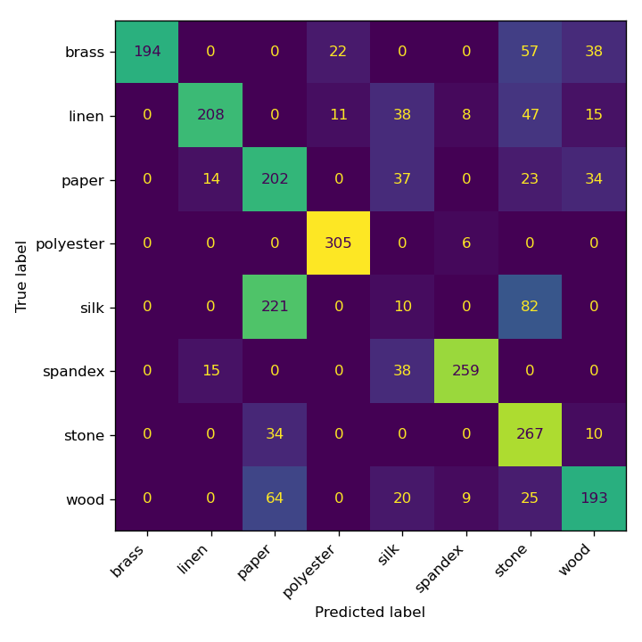

# VisTouch Baseline Classification Report

Task: 8-class material recognition. Split: train = force 3N+6N sessions, test = held-out 9N sessions. Clip source phase: `half`; each stored sample is 2.0 s. Train samples: 5049, test samples: 2506. Chance level: 0.125.

## Per-modality accuracy (RandomForest on hand-rolled features)

| modality | test accuracy |
|---|---|
| tactile | 0.194 |
| audio | 0.516 |
| video | 0.512 |
| **fused (all 3)** | **0.654** |

**Verdict: USABLE** (fused accuracy exceeds 2x chance level of 0.125).

## Fused-model classification report (test set)

```
              precision    recall  f1-score   support

       brass       1.00      0.62      0.77       311
       linen       0.88      0.64      0.74       327
       paper       0.39      0.65      0.49       310
   polyester       0.90      0.98      0.94       311
        silk       0.07      0.03      0.04       313
     spandex       0.92      0.83      0.87       312
       stone       0.53      0.86      0.66       311
        wood       0.67      0.62      0.64       311

    accuracy                           0.65      2506
   macro avg       0.67      0.65      0.64      2506
weighted avg       0.67      0.65      0.64      2506

```

## Confusion matrix (fused model, test set)



## Notes

- Features are intentionally simple/hand-rolled (no librosa/deep features) so the script runs with only numpy/scipy/opencv/sklearn -- this is a *usability sanity check*, not a SOTA benchmark result.
- Train/test are disjoint force levels from disjoint raw recordings, so this also measures generalization across pressure (3N/6N -> 9N), not just memorization of one recording.
- Trained fused model and scaler: `scripts/tasks/weights/classification_random_forest.joblib`.
