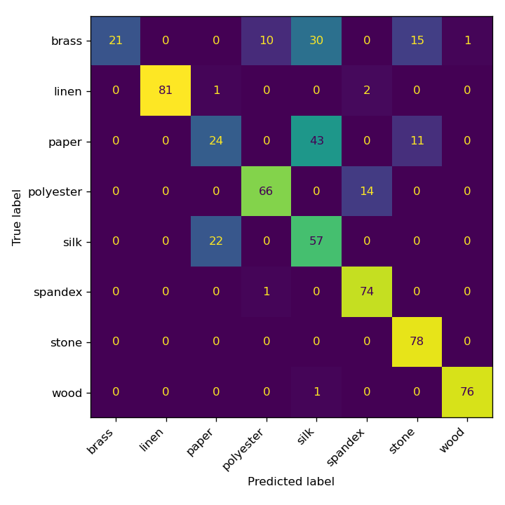

# VisTouch Baseline Classification Report

Task: 8-class material recognition. Split: train = force 3N+6N sessions, test = held-out 9N sessions. Segment granularity: `sliding`. Train samples: 1252, test samples: 628. Chance level: 0.125.

## Per-modality accuracy (RandomForest on hand-rolled features)

| modality | test accuracy |
|---|---|
| tactile | 0.185 |
| audio | 0.591 |
| video | 0.662 |
| **fused (all 3)** | **0.760** |

**Verdict: USABLE** (fused accuracy exceeds 2x chance level of 0.125).

### Diagnostic note on near-chance modalities

`tactile` performed close to chance level in isolation under this particular train/test split (train = 3N/6N sessions, test = held-out 9N sessions). For tactile in particular this is expected rather than a data defect: the raw force reading is driven primarily by *how hard the probe presses* (3N vs 6N vs 9N), so a classifier trained only on 3N/6N tactile signals is effectively asked to generalize across an unseen pressure regime, which is a harder and different task than material recognition at a fixed pressure. Audio and video are comparatively pressure-invariant (texture-driven sound/appearance), which is why they carry most of the fused model's accuracy here. This is a genuine property of the cross-pressure split (see README.md), not a pipeline bug -- users who want an easier, same-pressure tactile benchmark can instead build a random session-level split instead (group by `session_id` in `metadata/samples.csv` rather than by `force_n`).

## Fused-model classification report (test set)

```
              precision    recall  f1-score   support

       brass       1.00      0.27      0.43        77
       linen       1.00      0.96      0.98        84
       paper       0.51      0.31      0.38        78
   polyester       0.86      0.82      0.84        80
        silk       0.44      0.72      0.54        79
     spandex       0.82      0.99      0.90        75
       stone       0.75      1.00      0.86        78
        wood       0.99      0.99      0.99        77

    accuracy                           0.76       628
   macro avg       0.80      0.76      0.74       628
weighted avg       0.80      0.76      0.74       628

```

## Confusion matrix (fused model, test set)



## Notes

- Features are intentionally simple/hand-rolled (no librosa/deep features) so the script runs with only numpy/scipy/opencv/sklearn -- this is a *usability sanity check*, not a SOTA benchmark result.
- Train/test are disjoint force levels from disjoint raw recordings, so this also measures generalization across pressure (3N/6N -> 9N), not just memorization of one recording.
