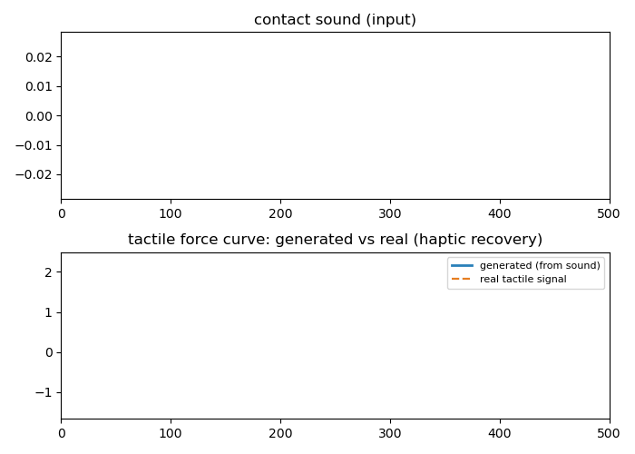

# VisTouch Task: Cross-Modal Generation (Sound -> Tactile Force Curve)

Haptic signal recovery -- the cross-modal generation task showcased in the companion paper (*Cross-Modal Semantic Communications*, IEEE WCM 2022), which evaluates recovered haptic signals with MAE. A small dilated 1D-CNN generates the 100Hz tactile force curve of a real press-slide event from the short-time log-energy contour of its contact sound, trained 60 epochs on 160 real train samples, evaluated on 80 held-out real test samples (9N split).

| metric | value |
|---|---|
| MAE (z-normalized force) | 0.2586 |
| Pearson correlation (generated vs real force curve) | 0.926 |

## Notes

- Input and target are cropped from the same contact-onset-aware, time-aligned window of one genuine capture; real tactile data in the released dataset is never modified or replaced by this task.
