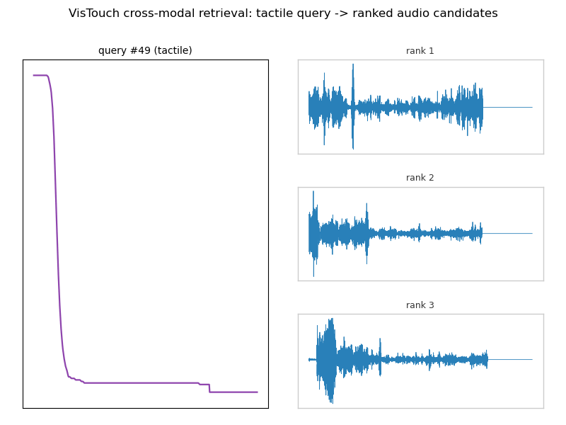

# VisTouch Task: Cross-Modal Retrieval

Two small 1D-CNN encoders (audio, tactile) trained with symmetric InfoNCE contrastive loss for 60 epochs on 160 real train `half` segments; evaluated on 80 held-out real test `half` segments (9N split).

| query -> gallery | Recall@1 | Recall@5 | chance@1 | chance@5 |
|---|---|---|---|---|
| audio -> tactile | 0.038 | 0.162 | 0.013 | 0.062 |
| tactile -> audio | 0.038 | 0.200 | 0.013 | 0.062 |

