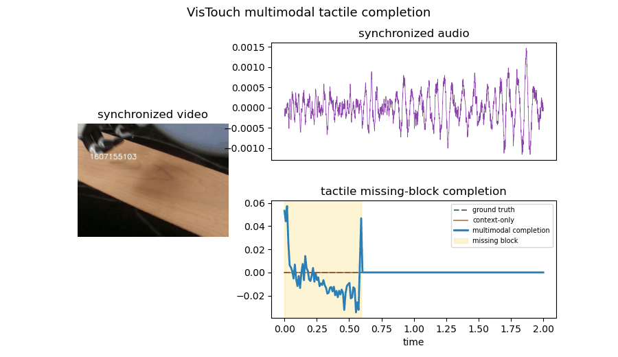

# VisTouch Task: Multimodal Tactile Completion

A contiguous tactile block is hidden and reconstructed from the remaining tactile context plus synchronized audio and video features. Metrics are calculated only inside the missing block.

| metric | context-only linear interpolation | multimodal model |
|---|---:|---:|
| MSE | 0.5484 | 0.0548 |
| MAE | — | 0.1109 |
| Correlation | — | 0.968 |

**MSE improvement over context-only interpolation: 90.0%.**

