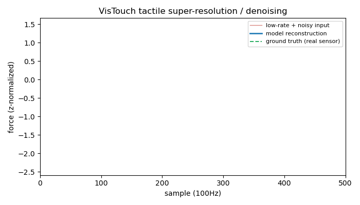

# VisTouch Task: Tactile Super-Resolution / Denoising

Model: small 1D CNN (4 conv layers) trained 40 epochs on 160 real train tactile curves; evaluated on 80 held-out real test curves (9N split).

Corruption (train+eval input only, never written back to the dataset): downsample by 5x then linearly upsample, + Gaussian noise (std=0.2).

| metric | low-rate+noisy input (baseline) | model reconstruction |
|---|---|---|
| MSE (z-normalized) | 0.0406 | 0.0027 |

**MSE improvement over the naive upsampled input: 93.3%.** Pearson correlation between reconstruction and real ground truth: 0.999.

